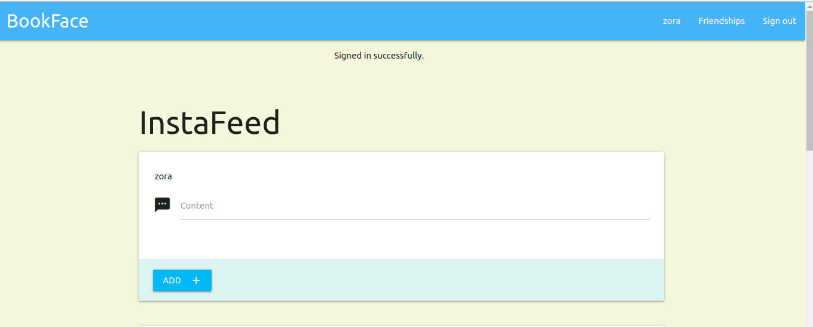

## Rails Facebook App :diamonds: 
>This project is a simple Facebook app developed with the framework Ruby on Rails, which includes the main features: registration, news feed, friendships requests, accepting friendship requests, deleting friends, posts, comments, and likes. We also implemented an optional sign-in with your real Facebook account by using Omniauth and Devise. It is deployed on Heroku. In the future, other characteristics can be added. 



The project proposed is in the next link:
<a href="https://www.theodinproject.com/courses/ruby-on-rails/lessons/final-project">www.theodinproject.com/final-project</a>

## Authors:
 👤 **Gonza Javier Mancilla**

- Github: [@gonjavi](https://github.com/gonjavi)
- Linkedin: [@g-javier-mancilla](https://www.linkedin.com/in/g-mancillla)

 👤 **Daniel alejandro Salgado**

- Github: [@alejocode](https://github.com/AlejoCode)
- Linkedin: [@d-salgado](https://www.linkedin.com/in/daniel-alejandro-salgado-sanchez-13a740b1/)

## Live Demo

[Live Demo Facebook App](https://bookfaces1.herokuapp.com/)

## Login Information 

You can use the next login information or create one to check the website: 

- User: zora@espe.com
- Password: 123456

## List of Features

- Sign up
- Sign in
- Sign in with Facebook account
- Sign out
- Feed/Main page
- Friendships page
- Send friend requests
- Accept friend requests
- View pending requests
- Suggested users
- Create posts
- Delete posts
- View posts shared by friends
- View my own posts 
- Edit my posts
- Comment on friend's posts and you own
- Delete my comments
- Like comments and posts  

## Future Updates/Improvements

Add the following characteristics:

- Add user photo
- Post images
- Delete account
- Forgot your password section
- Display profile section

## Built With
```bash
  Ruby 2.6.3
 ```
 ```bash
   Ruby on Rails 5.2.0
 ```
  ```bash
   Html5
 ```
  ```bash
   CSS3 - scss
 ```
  ```bash
   Materialize-sass
```
  ```bash
   JavaScript
  ```
  ```bash
  PostgresSQL
  ```

## Setup
* Install the gems listed in the Gemfile by :
```bash
$ bundle install
```
* Migrate the database by:
```bash
$ rails db:create and then, $ rails db:migrate
```
* Simply run the app with :
```bash
$ rails server or rails s
```

## RSpec Tests

For RSpec testing run the following commands:

- rails db:migrate RAILS_ENV=test
- rspec --format documentation


## 🤝 Contributing

Contributions, issues and feature requests are welcome!


## Show your support

Give a ⭐️ if you like this project!


## 📝 License

This project is [MIT](lic.url) licensed.

